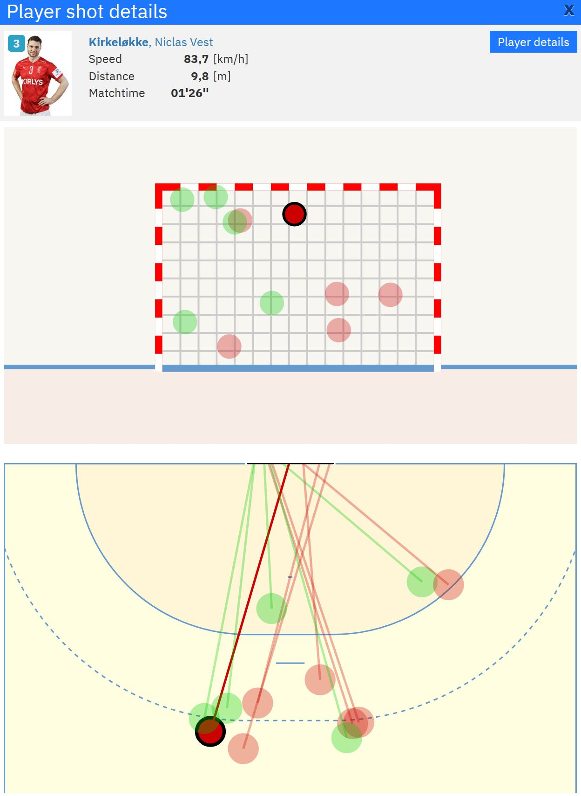

# ehf-euro-2022-pbp-iball-data
A repository for EHF EURO '22 play-by-play with iBall data

## Synopsis

With the 3rd version of the live ticker data for EHF events, tracking data has been made available for the men's european championship in 2022 and presumably for all EHF going forward. This repository contains the raw live ticker json's which provide play-by-play, metadata, and aggregate tracking data. Additionally one csv file which provides iBall shot tracking data (shooter location, shot on goal location, speed, distance, etc) for all matches. While you can access shooter location and shot on goal location from within the liveticker page, **other characteristics such as speed and distance are in the data but not revealed on the page**. In addition to EURO championship matches this also includes all qualificaiton matches going back to 2020. 

